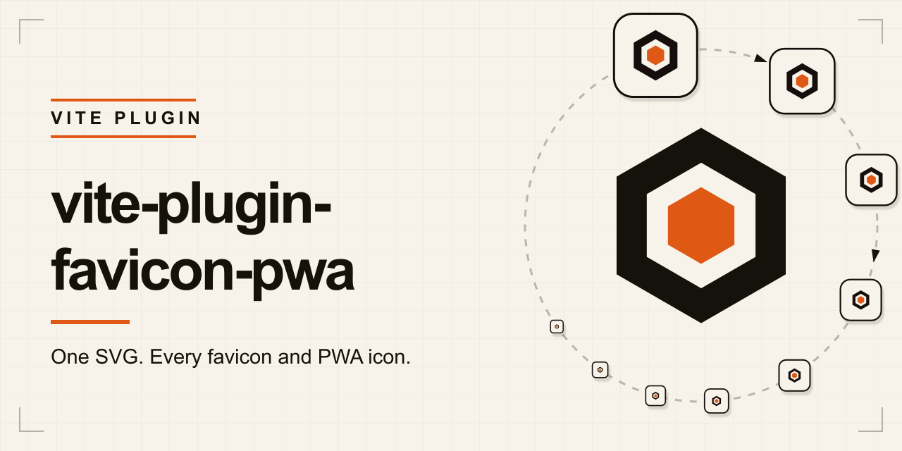

# vite-plugin-favicon-pwa



[](https://www.npmjs.com/package/vite-plugin-favicon-pwa)
[](https://github.com/cpswsg/vite-plugin-favicon-pwa/actions/workflows/ci.yml)
[](./LICENSE.md)

**One SVG in. Every favicon and PWA icon out.**

`vite-plugin-favicon-pwa` generates the favicon, Apple touch icon, PWA icons, and
web app manifest your Vite site needs—then injects the matching `<link>` and
`<meta>` tags into `index.html` automatically.

No icon-export checklist. No hand-maintained manifest. No stale HTML tags when
your branding changes.

## Why use it?

- **One source of truth** — generate every required size and format from a single
  SVG logo.
- **Works in dev and production** — assets are served from memory during
  development and emitted into the Vite build.
- **PWA-ready metadata** — generate a standards-based web app manifest, maskable
  icon, theme color, and mobile app tags.
- **Deploy anywhere** — asset URLs honor root, subpath, relative, and CDN Vite
  base configurations.
- **Design control included** — configure colors, padding, corner radius, app
  name, language, direction, and output location.
- **Focused by design** — no service worker and no offline runtime to configure.

## Quick start

Install the plugin:

```sh
npm install --save-dev vite-plugin-favicon-pwa
```

Add one SVG with a `viewBox`, then configure the plugin:

```ts
// vite.config.ts
import { defineConfig } from 'vite';
import faviconPwa from 'vite-plugin-favicon-pwa';

export default defineConfig({
  plugins: [
    faviconPwa({
      name: 'My App',
      source: 'public/favicon.svg',
    }),
  ],
});
```

Run Vite. The complete asset set and HTML metadata are generated automatically.

## What it generates

- One SVG in, a complete icon set out: `favicon.ico`, `favicon.svg`,
  `apple-touch-icon.png`, and 192 / 512 / maskable PWA PNGs, plus a
  `manifest.webmanifest`.
- The mark is centered on a square canvas with configurable padding. Foreground
  (the mark) and background are both configurable, so the logo can be recolored
  per icon.
- The Apple touch icon is emitted as an opaque, full-bleed square, because iOS
  applies its own mask and renders transparency as black. The favicon and `any`
  PWA icons keep the configured corner rounding; the maskable icon is square by
  construction.
- Root SVG presentation attributes such as `fill`, `stroke`, `color`,
  `fill-rule`, and `style` are preserved when the mark is placed on the square
  canvas. Layout attributes controlled by the generated wrapper are ignored.
- Accepts `oklch()` colors, including `deg`, `grad`, `rad`, and `turn` hue units,
  anywhere (background, foreground, theme color), and
  converts them to sRGB for `sharp` and the manifest. Hex, `rgb()`, and named
  colors pass through untouched.
- Asset and manifest URLs honor absolute, subpath, and relative Vite bases.
- Source changes regenerate the in-memory asset set during development and
  trigger a full-page reload.
- Tags are injected immediately after the `viewport` meta tag when present.

`sharp` and `png-to-ico` are pulled in as dependencies. `vite` is a peer
dependency (`>=6`); packed consumers are tested against the latest Vite 6, 7,
and 8 releases.

**Requirements:** Node `>=22`, Vite `>=6`, and a source SVG that has a `viewBox`.

## Usage

Customize the generated branding and manifest metadata as needed:

```ts
// vite.config.ts
import { defineConfig } from 'vite';
import faviconPwa from 'vite-plugin-favicon-pwa';

export default defineConfig({
  plugins: [
    faviconPwa({
      source: 'public/favicon.svg',
      name: 'My App',
      shortName: 'App',
      description: 'A short description of the app.',
      background: '#f7f3ea',
      themeColor: '#15110b',
    }),
  ],
});
```

For the tags to land in a predictable spot, include a `viewport` meta tag in your
`index.html`. The plugin inserts its markup immediately after it:

```html
<meta name="viewport" content="width=device-width, initial-scale=1" />
```

If the `viewport` marker is missing, the tags fall back to Vite's default head
injection.

## Example

The repository includes a complete [Favicon Lab example](example/) that consumes
the package through its public export. It previews every generated asset,
demonstrates maskable-icon cropping, displays the generated manifest, and reports
whether it is running in a browser tab or as an installed app.

Run it locally:

```sh
npm run example:dev
```

Build the production example:

```sh
npm run example:build
```

## Source SVG

The source must contain a positive `viewBox`; `width` and `height` are not
required. Non-zero viewBox origins and either single- or double-quoted
attributes are supported.

The generated SVG keeps presentation inherited from the source root, including
fills, strokes, color, opacity, fill rules, classes, and inline styles. Root
layout attributes such as `width`, `height`, `viewBox`, `x`, `y`, and
`preserveAspectRatio` are replaced by the generated canvas geometry.

When `foreground` is set, explicit and inherited fills are recolored.
`fill="none"` and `url(...)` paint references inside the mark are preserved.
Strokes are not recolored.

## Options

`name` is required. All other options are optional.

| Option            | Type     | Default                     | Description                                                                                   |
| ----------------- | -------- | --------------------------- | --------------------------------------------------------------------------------------------- |
| `source`          | `string` | `public/favicon.svg`        | Source SVG, relative to the project root. Must contain a `viewBox`.                            |
| `outDir`          | `string` | `assets/favicons`           | URL-safe output folder, relative to the site root; each segment may use letters, numbers, `.`, `_`, `~`, or `-`. Use `''`, `'.'`, `'/'`, or `'./'` to write the set to the site root itself. See [Serving from the site root](#serving-from-the-site-root). |
| `appRoot`         | `string` | (derived from Vite `base`)  | Manifest application root. Set an absolute app URL when `base` points to a CDN.                |
| `background`      | `string` | `#f7f3ea`                   | Square canvas background, and the maskable icon background.                                    |
| `foreground`      | `string` | (source colors)             | Recolor explicit and inherited mark fills. Preserves inner `none` and `url()` paints.          |
| `padding`         | `number` | `0.1`                       | Mark inset on standard icons, as a fraction of the canvas (0 ≤ value < 0.5).                    |
| `maskablePadding` | `number` | `0.3`                       | Larger inset for the maskable icon's safe zone (0 ≤ value < 0.5).                              |
| `radius`          | `number` | `0.18`                      | Background corner radius as a fraction of the canvas (0 to 0.5). Not applied to the Apple touch icon or the maskable icon. |
| `name`            | `string` | (required)                  | PWA manifest `name`.                                                                           |
| `shortName`       | `string` | (falls back to `name`)      | PWA manifest `short_name`, and the apple web app title.                                        |
| `description`     | `string` | (omitted)                   | Optional PWA manifest `description`.                                                           |
| `themeColor`      | `string` | `#15110b`                   | `theme-color` meta and manifest `theme_color`.                                                 |
| `manifestCrossOrigin` | `string` | (omitted)               | `crossorigin` on the manifest `<link>`: `anonymous` or `use-credentials`. Set `use-credentials` when the manifest is behind cookie auth. |
| `lang`            | `string` | `en`                        | Manifest language tag (BCP 47).                                                                |
| `dir`             | `string` | `auto`                      | Direction of localizable manifest strings: `ltr`, `rtl`, or automatic inference.               |

## Generated assets

Written to `<outDir>` (default `assets/favicons/`):

- `favicon.svg` — 512px master, recolored if `foreground` is set
- `favicon.ico` — 16 / 32 / 48 px
- `apple-touch-icon.png` — 180px, opaque and full-bleed (iOS applies its own mask)
- `pwa-192x192.png`, `pwa-512x512.png` — with the configured corner radius
- `pwa-maskable-512x512.png` — with the larger maskable safe-zone padding
- `manifest.webmanifest`

## Serving from the site root

Browsers, crawlers, and link-preview bots request `/favicon.ico` at the
well-known root path without reading `<link rel="icon">`. Set `outDir` to the
site root to answer them:

```ts
faviconPwa({ name: 'My App', outDir: '/' });
```

`''`, `'.'`, `'/'`, and `'./'` all mean the site root. Hrefs, dev-server
routes, and manifest URLs still honor Vite's `base`, so a `base` of `/app/`
serves `/app/favicon.ico`.

**Move your source SVG out of `public/` first.** Vite copies `publicDir`
verbatim into the build output root, which is exactly where root `outDir`
writes the generated set. The copy runs first and the generated assets are
written over it, so a file in `public/` named after a generated asset is
silently replaced by the generated one. In dev the plugin's middleware answers
first, so the same file is shadowed there. The default `source` is
`public/favicon.svg`, so the quick-start setup hits this the moment you switch
to root output:

```ts
faviconPwa({ name: 'My App', outDir: '/', source: 'src/logo.svg' });
```

The same applies to a hand-made `public/favicon.ico` or any other file sharing a
[generated name](#generated-assets): the generated asset wins and yours is lost.
The plugin warns at startup and names the conflicting paths.

A *directory* in `public/` sharing a generated name is worse than a lost file: a
generated asset cannot be written over it, so the build fails with a low-level
write error from the bundler. The plugin warns about those separately, ahead of
the failure, so the cause is named.

## Injected tags

```html
<link rel="icon" href="/assets/favicons/favicon.ico" sizes="16x16 32x32 48x48" />
<link rel="icon" href="/assets/favicons/favicon.svg" type="image/svg+xml" />
<link rel="apple-touch-icon" href="/assets/favicons/apple-touch-icon.png" />
<link rel="manifest" href="/assets/favicons/manifest.webmanifest" />
<meta name="theme-color" content="#15110b" />
<meta name="mobile-web-app-capable" content="yes" />
<meta name="apple-mobile-web-app-capable" content="yes" />
<meta name="apple-mobile-web-app-title" content="My App" />
```

## Vite base paths

Injected hrefs include Vite's `base`, so root and subpath deployments work as
expected:

```ts
export default defineConfig({
  base: '/app/',
  plugins: [faviconPwa({ name: 'My App' })],
});
```

Relative builds using `base: './'` or `base: ''` are supported too. Because a
relative href resolves against the document that carries it, each HTML entry
gets its own prefix, computed from that document's depth. In a multipage build
with the default `outDir`, `index.html` receives
`./assets/favicons/favicon.ico` while `docs/guides/index.html` receives
`../../assets/favicons/favicon.ico`. Absolute and CDN bases are depth
independent and every entry shares one href.

Manifest icons use bare filenames so they resolve beside
`manifest.webmanifest`. Manifest `id`, `start_url`, and `scope` point back to
the application root based on the depth of `outDir`.

For example, the default `outDir: 'assets/favicons'` produces the following
relative manifest fields:

```json
{
  "id": "../../",
  "start_url": "../../",
  "scope": "../../",
  "icons": [{ "src": "pwa-192x192.png" }]
}
```

With a root `outDir` there is nothing to step out of, so under a relative base
those fields are `./`. Under an absolute base they are the base itself, root
`outDir` or not: `/` by default, `/app/` for `base: '/app/'`.

When `base` is a full URL (typically a CDN), the manifest omits `id`,
`start_url`, and `scope`. Those URLs must match the application document's
origin, which cannot be inferred from a CDN base, so the browser falls back to
the document being installed. Icon and manifest asset URLs still use the CDN
base. To retain a stable identity and browser install promotion, set the
application origin explicitly:

```ts
faviconPwa({
  name: 'My App',
  appRoot: 'https://app.example.com/',
})
```

### Manifests behind cookie auth

The manifest is always fetched as a CORS request, and the link's `crossorigin`
attribute selects only the credentials mode. Leaving it off is the same as
`anonymous`: credentials mode `same-origin`, so cookies ride along on a
same-origin manifest and are dropped on a cross-origin one. If the manifest
sits on another origin and requires cookies, ask for them:

```ts
faviconPwa({
  name: 'My App',
  manifestCrossOrigin: 'use-credentials',
})
```

That server must then answer with `Access-Control-Allow-Credentials: true` and
name the document origin in `Access-Control-Allow-Origin`, since a wildcard is
rejected for credentialed requests.

## FAQ

### Does this make my app installable?

It generates the icons, manifest, and browser metadata used for installation.
Browser requirements still apply, including HTTPS and a qualifying manifest.
Installation behavior varies by browser and platform.

### Does it add a service worker or offline support?

No. This plugin owns favicon and PWA image generation plus metadata injection.
Add a service worker separately if your application needs offline behavior.

### Can I use an existing PNG logo?

The source must be SVG and include a positive `viewBox`. SVG provides one
resolution-independent source for every generated icon size.

### Does it work when my Vite app is deployed under a subpath?

Yes. Generated URLs honor Vite's `base`, including absolute paths, subpaths,
relative builds, and CDN URLs. See [Vite base paths](#vite-base-paths) for CDN
application-root considerations.

### Is this a full PWA framework?

No. It is a focused favicon and PWA asset generator. It pairs well with your
preferred service-worker or PWA solution when you need caching and offline
behavior.

## Security

`npm audit --omit=dev` is the release gate and must be clean: it covers the
dependency tree consumers actually install, which is `sharp` and `png-to-ico`.
The published package ships `dist` only, and consumers never receive this
repository's development lockfile.

A full `npm audit` runs in CI as informational. As of v1.2.0 it reports one
advisory, `nanoid` reached through `vite` -> `postcss`, which is development
tooling and absent from the runtime tree. Findings of that shape are resolved by
upgrading the toolchain once upstream's supported range includes a patched
release, not by adding an override to silence the audit. An override would force
a transitive version outside the range upstream tests against, so any such change
has to clear the packed-package matrix against Vite 6, 7, and 8 first.

## License

MIT (c) Cynthia Swain-Sugarman
